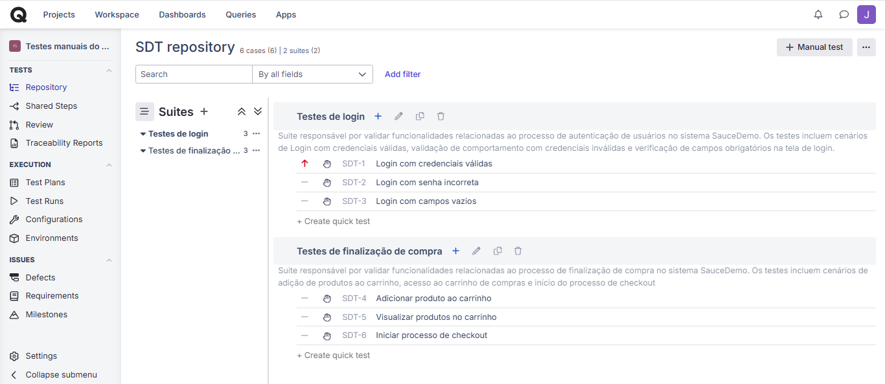
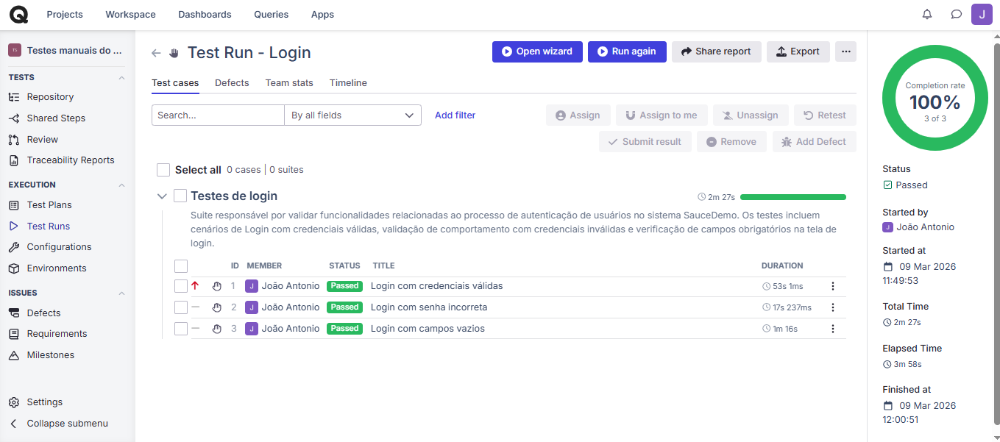
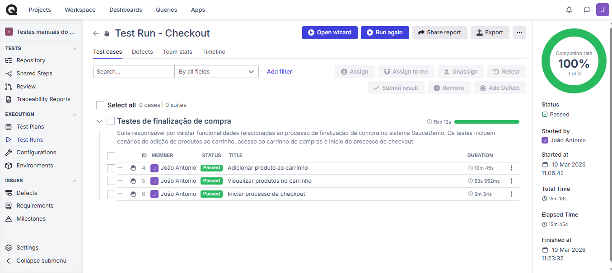

# Projeto de Testes Manuais - SauceDemo

Este projeto foi desenvolvido como parte dos meus estudos para atuar como QA (Quality Assurance).

O objetivo é demonstrar conhecimentos em planejamento, criação e execução de testes manuais.

## Ferramentas utilizadas

- Qase 
- GitHub

## Funcionalidades testadas

### Login
- Login com credenciais válidas
- Login com credenciais inválidas
- Validação de campos obrigatórios

### Checkout
- Adição de produtos ao carrinho
- Acesso ao carrinho de compras
- Início do processo de checkout

## Cobertura de testes

| Funcionalidade | Cenários de teste | Status |
|---|---|---|
| Login de usuário | Login com credenciais válidas / Login com senha incorreta / Login com campos vazios | Executado |
| Carrinho de compras | Adicionar produto ao carrinho / Visualizar produtos no carrinho | Executado |
| Checkout | Iniciar processo de checkout | Executado |

## Cenários de teste (Gherkin)

Os cenários de teste deste projeto foram escritos utilizando a linguagem **Gherkin**, seguindo a estrutura:

Dado  
E  
Quando  
Então  

Os cenários foram organizados em suites de testes e executados utilizando a ferramenta Qase.

Os cenários completos podem ser visualizados no arquivo:

📄 test-cases/gherkin-test-cases.md

## Estrutura das suites de testes

## Evidências da execução dos testes

### Execução da suite de testes de Login

### Execução da suite de testes de Checkout

## Bug report

Foi documentado um bug relacionado à validação de campos de login.

Localização:

/bug-report/bug-report-login.md

