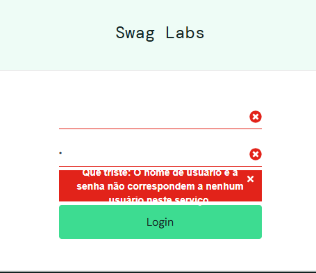

# Bug Report

## ID
BUG-001

## Título
Validação inadequada de campos no login ao inserir espaços em branco

## Sistema
SauceDemo

## URL
https://www.saucedemo.com

## Ambiente
Browser: Google Chrome  
Sistema Operacional: Windows 10

## Descrição

Ao inserir apenas espaços em branco nos campos de login, o sistema não trata corretamente os campos como vazios e retorna uma mensagem genérica de credenciais inválidas.

O comportamento esperado seria validar os campos obrigatórios antes de realizar a autenticação.

## Passos para reproduzir

1. Acessar a página de login do SauceDemo
2. Inserir um espaço em branco no campo **Username**
3. Inserir um espaço em branco no campo **Password**
4. Clicar no botão **Login**

## Resultado esperado

O sistema deve validar os campos obrigatórios e exibir mensagem informando que os campos **Username** e **Password** são obrigatórios.

## Resultado obtido

O sistema retorna a mensagem:

"Username and password do not match any user in this service"

mesmo quando os campos contêm apenas espaços em branco.

## Severidade

Baixa

## Prioridade

Baixa

## Evidência do problema

